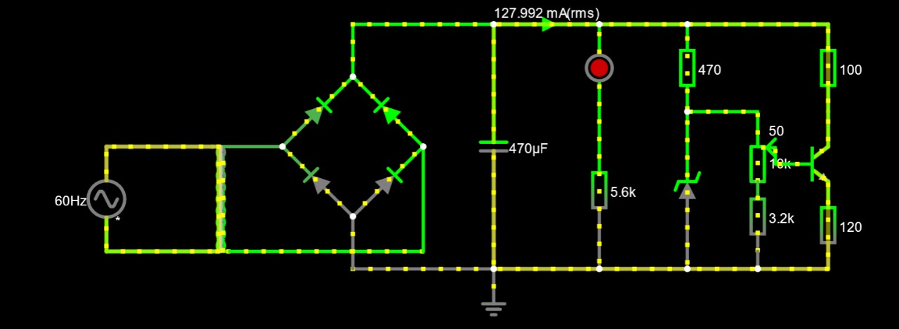

# Fonte de Tensão
Projeto realizado na disciplina Eletrônica para Computação no ICMC/USP. Esse projeto faz parte dos trabalhos que compõem a nota da disciplina.

TO-DO:
~~1) Diagrama da Fonte com os valores dos componentes escolhidos e uma lista de componentes, contendo valores e preços~~
~~2) Link para o circuito no Falstad~~
3) Esquemático do PCD no EAGLE
4) Incluir fotos da placa/protoboard com o circuito montado Incluir um VIDEO mostrando o Projeto funcionando e simulando, e explicando porque escolheu os valores dos componentes (Upa o vídeo no Youtube ou google drive e poe um link no Readme do teu Github/gitlab).
5) Colocar o link da apresentação do trabalho

## Grupo:
- Heitor Gomes de Oliveira - 15458350
- Matheus Guilerme Ferreira Mendonça Learte - 15522362
- Raul Ribeiro Teles - 13688176
- Vitor Daniel de Resende - 15554396

## Componentes Eletrônicos
| Quantidade     | Componente | Descrição | Valor |
| ---   | ---                 | ---                | ---      |
| 1 	| [Transformador] 	  | 18 V			   | R$ 0,00  |
| 1     | [Protoboard] 		  | Pequena 400 furos  | R$ 0,00  |
| 1     | [Capacitor] 	      | 470 uF / 35 V      | R$ 5,44  |
| 1     | [Potenciômetro]     | 10 kΩ 1 W 	       | R$ 6,79  |
| 1     | [Resistor] 	      | 1 kΩ 1/4 W         | R$ 0,35  |
| 1     | [Resistor] 	 	  | 4 kΩ 1/4 W         | R$ 0,35  |
| 1     | [Resistor]          | 5.6 kΩ 1/4 W       | R$ 0,35  |
| 1     | [Diodo Zener]       | 13V 1 W            | R$ 0,49  |
| 1     | [LED] 			  | 5mm vermelho       | R$ 0,49  |
| 1     | [Transistor] 		  | NPN 2N3904   	   | R$ 1,55  |
| 4 	| [Diodo Retificador] | 1N4007 		       | R$ 0,76  |
| 1     | [Kit Jumper]        | Macho/Macho        | R$ 6.79  |

Valor Total: R$ 23,36

## Projeto no Falstad

[Link para o projeto](https://tinyurl.com/2nkhrl93)

## Cálculo dos componentes

### Razão do Transformador
Saída de tensão para o capacitor: $24,2 V$
Razão: $7,02$

### Teste de piso
$127\cdot\sqrt(2)=179,6 V$

### Saída do transformador
